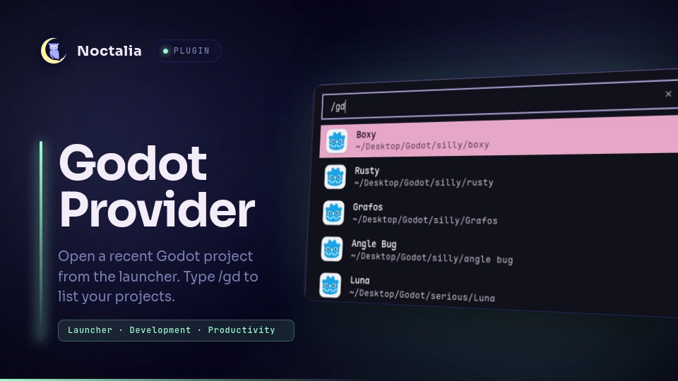

# Godot Provider

Godot Provider integrates all projects within the project manager with the 
Noctalia launcher so you can open a project quickly without leaving the shell.

## Plugin

| Field | Value |
| --- | --- |
| ID | `ramosdetrigo/godot-provider` |
| Entry | Launcher provider: `provider` |
| Launcher Prefix | `/gd` |

## Requirements

Install [Godot](https://godotengine.org/) and ensure `godot` is available on
`PATH` as `godot`. Alternatively, you can set the path to the godot binary in
the plugin's settings. The `nohup` command is required to launch Godot.

## Usage

Open the Noctalia launcher and type `/gd` to list local Godot projects.
Continue typing to filter projects by name, then select one to open it with
`godot`.

## Settings

- `sort_by` — Sort projects by last used or most opened projects in the launcher.
- `projects_path` — The path to Godot's projets.cfg file.
- `godot_command` — The shell command to open godot.

## Notes

Projects are read from Godot's projects.cfg file, typically at
`~/.local/share/godot/projets.cfg`. The list is cached for the launcher session
and refreshed when you clear the query.

The `sort_by` setting sorts by writing the project's ids in a json inside the plugins' 
[`pluginDataDir`](https://docs.noctalia.dev/v5/plugins/development/runtime-api/?section=filesystem#filesystem).

Small parts of the code were taken or based upon the [zed-provider](https://github.com/noctalia-dev/community-plugins/tree/main/zed-provider) plugin.
